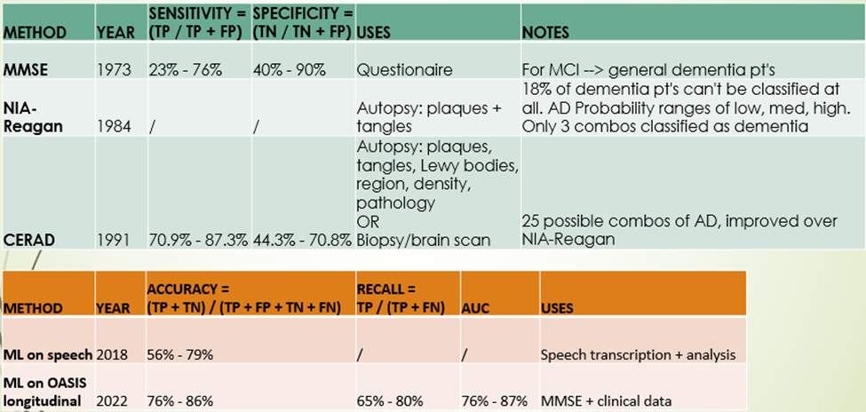
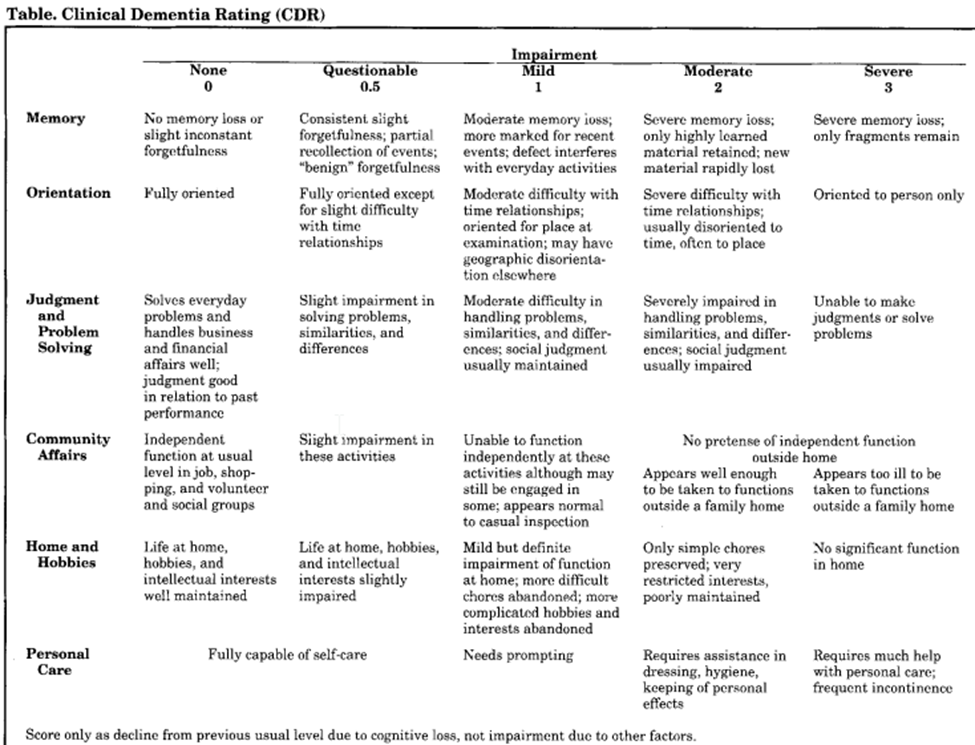
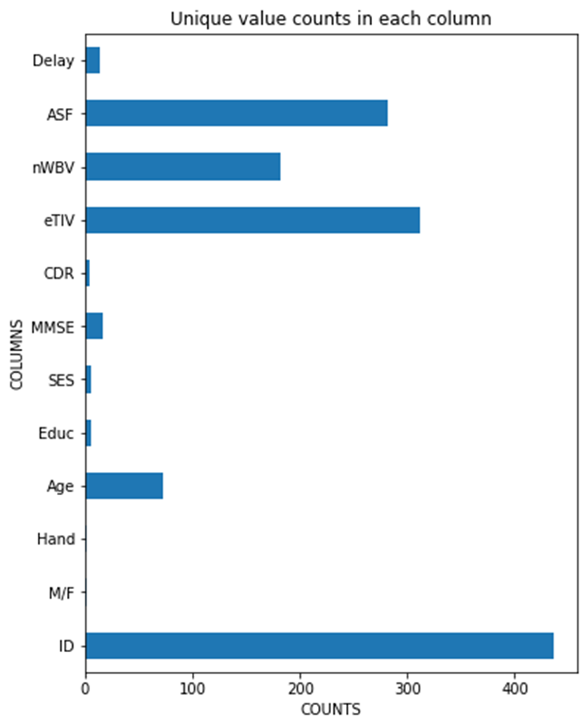
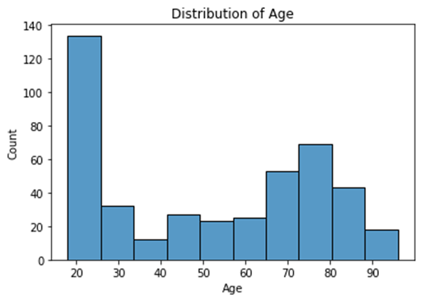
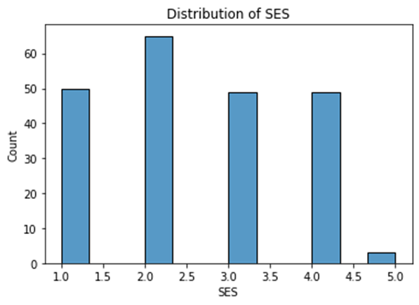
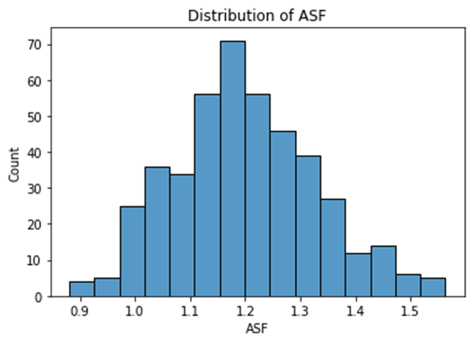
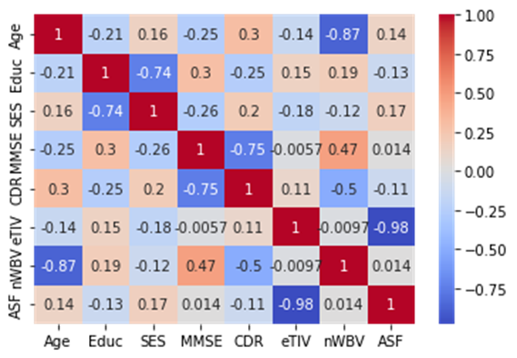

# Diagnosing Alzheimer’s Disease with Machine Learning

### By Eugene Fong

### Spring 2023

### Prof Chaojie Wang’s Capstone in Data Science class

### DATA 606 @UMBC

# OVERVIEW

### PHASE 1 – Proposal & Planning

###### - Literature search: Alzheimer’s Disease

###### - Diagnosing Alzheimer’s is hard!

###### - OASIS dataset

### PHASE 2 – Data prep, EDA, & Data Viz

###### - Stats & Data viz

###### - Data cleansing & transformation

### PHASE 3 – Model training & Deployment

###### - Stratified train/test split

###### - Model training

###### - Prediction evaluation

###### - Conclusion

###### - Future directions

# PHASE 1 – Proposal & Planning

##### Literature search: Alzheimer’s disease (AD)

Figure comparing the changes between healthy brains to Alzheimer’s disease brains (Breijyeh & Karaman, 2020)

Alzheimer’s disease (AD) is a progressive neurodegenerative disease which causes a decline in cognitive functions until death. It is the main cause of dementia and is rapidly increasing worldwide, roughly doubling every 5 years. The direct cause  is still an issue of hot debate, but the literature has many risk factors listed such as: “increasing age, genetic factors, head injuries, vascular diseases, infections, and environmental factors” (Breijyeh & Karaman, 2020). From a clinical standpoint, AD patients exhibit “memory loss… change of personality… progressive loss of cognitive functions” (Breijyeh & Karaman, 2020). From a biomolecular examination, autopsies have revealed neuritic plaques and neurofibrillary tangles, which are predicted to be caused by amyloid-beta (AB) plaques interfering with acetylcholine (ACh), its receptors, and/or production in the nucleus basalis of Meynart (NBM) in the basal forebrain (Breijyeh & Karaman, 2020). However, whether AB plaques are truly the root cause of Alzheimer’s is now under scrutiny after neuroscientist and physician, Matthew Schrag, reexamined the initial research identifying AB plaques as the root cause by Sylvain Lesne. Some of the results from Lesne’s 2006 papers may have been manipulated (Potential Fabrication in Research Images Threatens Key Theory of Alzheimer’s Disease, n.d.). Prior to 2021, the AD drugs available could only address some of the individual symptoms of AD, with no effect on the final outcome of the disease (Breijyeh & Karaman, 2020). Beginning in 2021, the FDA approved 3 new AD drugs: Aducanumab in 2021, Lecanemab and Donanemeb in 2023 – all with their own fair share of controversy:

- “Aducanumab does not cure or reverse [AD]… reduced amyloid plaque levels, but that did not translate to any clinical effect… Potentially serious harms are common” (Woloshin & Kesselheim, 2022).
- “Lecanemab slowed clinical decline by 27%” (Lecanemab, the New Alzheimer’s Treatment, n.d.).
- “Donanemab slowed mental decline by 35%” (Reardon, 2023)

These 3 new drugs target AB plaques, but none of them can reverse or stop Alzheimer’s completely, which may be an indication that AB plaques may not be the root cause of Alzheimer’s and that as a result of fabricated research results, researchers have been pursuing the wrong target.

###### Diagnosing Alzheimer’s is hard!

MMSE scoring chart (*Mini-Mental State Exam (MMSE) Test for Alzheimer’s / Dementia* , n.d.).

The process of diagnosing AD has changed quite a bit over the decades. The Mini-Mental State Exam (MMSE) was one of the early attempts in 1973 to diagnose AD using a simple questionnaire (Mini-Mental State Exam (MMSE) Test for Alzheimer’s / Dementia, n.d.). However, the sensitivity ranged from a low 23% up to 76%, while specificity ranged from 40% - 94% (Arevalo-Rodriguez et al., 2021), but was limited to patients who already had mild cognitive impairment (MCI) and works better with repeated follow-ups to mark the pace of mental degradation converting to AD (Arevalo-Rodriguez et al., 2021). The next major iteration was in 1984 with the National Institute on Aging and the Reagan Institute Working Group on Diagnostic Criteria for the Neuropathological Assessment of Alzheimer’s Disease (NIA-Reagan) criteria, which could diagnose patients after death via an autopsy looking for AB plaques and tangle formation (Beach et al., 2012). This method could only identify 3 combinations of dementia with low, medium and high probability ranges, and had a subset of patients that could not be classified at all, leaving a large patient population underserved (Beach et al., 2012). Further refinement led to the creation of the Consortium to Establish a Registry for Alzheimer’s Disease (CERAD) diagnostic in 1991 which has grown to include more methods, such as: autopsy, biopsy, brain scans which can look for more biomarkers of 25 different combinations of AD and be applied in living patients (Beach et al., 2012). Sensitivity improved to 71% - 87%, specificity range of 44% - 70% (Beach et al., 2012). These ranges are certainly an improvement upon the MMSE and NIA-Reagan methods, however, it still leaves a large range of uncertainty.

Recently, there have been attempts to diagnose AD with the help of automated methods and Machine Learning (ML) algorithms. In 2018, a paper by Ammar and Ayed used ML speech analysis to identify AD patients with a 56% - 79% accuracy rate (Ben Ammar & Ben Ayed, 2018). Researchers can also utilize a group of “atlas normalization” techniques to compare brain scans across different patients, while accounting for individual differences in head shape, developmental and internal brain matter. Atlas Scaling Factor (ASF) matches individual head size to the standardized reference atlas of the human brain (Buckner et al., 2004). ASF is used to compute the estimated Total Intracranial Volume (eTIV), which includes all of the internal brain structures (Buckner et al., 2004). Normalized whole-brain volume (nWBV) uses digital segmentation tools to label gray/white matter from cerebral spinal fluid (CSF) and sum up the gray/white matter areas (Buckner et al., 2004). AD patients develop lesions which fill with CSF as parts of the brain waste away, so this is essentially a measurement of brain matter VS empty space. In 2022, Goulikar Laxmi Narasimha Deva’s research paper used these measurements provided in one of the Longitudinal OASIS datasets as the basis for ML Alzheimer’s diagnosis and achieved 76% - 86% accuracy, 65% - 80% recall, and 76% - 87% on Area Under the Curve (AUC) scores (Deva, 2022).

Summary of all methods and their respective evaluation metrics from my literature review.

###### OASIS dataset

(Marcus et al., 2007)

The Open Access Series of Imaging Studies (OASIS) research group “is … aimed at making neuroimaging data sets of the brain freely available to the scientific community” (Marcus et al., 2007). Since 2007, OASIS has been publicly releasing their collection of Alzheimer’s brain scans along with patient biomarkers to encourage open development of improved AD diagnosis and research (Marcus et al., 2007). There are currently 4 OASIS datasets. published from 2007 – 2020, utilizing several different brain scanning techniques, such as: CT, MRI, PET, and looking at different patient cohorts like healthy non-demented controls VS dementia in various stages, as well as longitudinal studies where patients return for follow-up VS cross-sectional studies with just one observation of each patient (Marcus et al., 2007).

I located my dataset on Kaggle, which is a merged subset of the OASIS-1 Cross-sectional dataset sans MRI brain scan images (Boysen, n.d.). This is textual data in a CSV format looking at a cohort of 416 dementia VS non-demented patients (Marcus et al., 2007). They have MRI scans at one point in time and while some do appear again for follow-up, I will not be using the follow-up or Longitudinal dataset, nor will I be analyzing any of the MRI images (Marcus et al., 2007). The variables measured and their labels in the dataset were:

- ID = Patient ID
- M/F = Gender
- Hand = Handedness
- Age = Age
- Educ = Education level
- SES = Socioeconomic Status
- MMSE = Mini-Mental State Exam
- CDR = Clinical Dementia Rating
- eTIV = Estimated Total Intracranial Volume
- nWBV = Normalized Whole Brain Volume
- ASF = Atlas Scaling Factor
- Delay = When patients returned within a 90-day window for follow-up MRI scans (for longitudinal study)

Patient IDs are mostly unique, except for a small set of ~20 who returned within a 90-day delay period for follow-up in the longitudinal study (Marcus et al., 2007). There are male/female differences in the eTIV measurements, so it’s important to account for this (Buckner et al., 2004). Handedness is most likely important due to the dominant side of the brain being better well-connected; all patients here were right-handed. Ages ranged from ~20 - ~90 (Marcus et al., 2007).

The Education levels were further subdivided into discrete numerical labels where: 1 = less than high school grad, 2 = high school grad, 3 = some college, 4 = college grad, 5 = beyond college (Marcus et al., 2007). The Socioeconomic Status (SES) is also subdivided into discrete numerical labels, but I could not find a key in any of the referenced papers which included what each label meant. MMSE is the first AD diagnostic method involving a questionnaire, which while weak on its own as a single-use diagnostic tool, may be a good metric in combination with other diagnostics and/or long-term monitoring (Arevalo-Rodriguez et al., 2021). Clinical Dementia Rating (CDR) is a rating scale testing multiple mental faculties, such as: memory, orientation, judgment and problem solving, community affairs, home and hobbies, and personal care (Morris, 1993). The levels of impairment for each function are rated as: 0 = nondemented, 0.5 = very mild dementia, 1 = mild dementia, 2 = moderate dementia (Morris, 1993). The eTIV, nWBV, and ASF columns are the set of normalization techniques applied to brain scans to make them comparable across individuals. Delay is the return window within 90-days that patients in the longitudinal study returned for additional scans.

CDR criteria for ranking AD severity (Morris, 1993).

### PHASE 2 – Data prep, EDA, & Data Viz

###### Stats & Data viz

Initial inspection of the dataset columns shows that its shape is 436 rows by 12 columns. There are 416 patients, with 20 who returned after a delay for follow-up, which adds up nicely to the 436 rows. Most of the column data types are numerical: 7 floats and 2 integers. 3 of the columns are categorical. Checking for null values, most of them have values, but almost all of delay is null, which is expected since only 20 patients returned for follow-up. A concerning number of rows in Educ, SES, MMSE, and CDR are null as well. If I look at the unique values instead, I can see that the ID column is 100% unique, while the Hand and M/F columns have 1 and 2 unique values respectively.

Since most of the columns are numerical, it makes sense to look at the distribution of data. The age of most of the participants were distributed from around 20 to around 90, with 2 larger groups around 20 and 75.

Education levels were distributed mostly evenly across all bins, with fewer below HS graduate level, and most at HS level.

SES, as noted earlier, did not have any key explaining what the bin labels meant. My own exploratory data analysis (EDA) of the SES column showed that for the most part, it was evenly distributed amongst all categories, except the highest level of which there were very few patients. Bin 5 is presumably for billionaires and trillionaires, who may be hard to find, while bin 2 is probably middle class and would make sense to be more common than the other groups.

The higher MMSE scores indicate normal cognitive function, while decreasing scores indicate increasing severity of dementia (Mini-Mental State Exam (MMSE) Test for Alzheimer’s / Dementia, n.d.). We can see that the vast majority of the patients are in the normal range. There is a spread of patients with decreasing scores tapering off before reaching the lowest score of 0. Using the MMSE criteria then, the patients with the most extreme AD cases reach moderate levels of dementia.

The distribution of the CDR scores has most of the patients at 0, which is non-demented. The patients with scores > 0 make up < 50%. Some of these patients are categorized as questionable or mild impairment, with a few reaching moderate impairment levels. Notably, this corroborates with the MMSE results which have similar gradings, with fewer and fewer patients as severity increases, and none of the patients reaching the most severe level of dementia.

eTIV is surprisingly almost a perfect normal distribution. This may be a result of having already normalized the patients towards a reference standard.

nWBV is a little bit skewed, but almost normal. It also needs to undergo a normalization process which may have resulted in this shape.

Similar situation for ASF which also looks like a perfect normal distribution.

The boxplots for this data shows varying levels of outliers and whether they are mostly within the 2 center quartiles of IQR. Since I have so few samples, I think it’s best not to remove the outliers. Most of the patients are healthy, non-demented controls, thus, removing outliers would likely remove many of the AD patients who are the ones I intend to diagnose. Many of the hallmarks of Alzheimer’s should be outliers compared to healthy controls.

A Pearson Correlation heatmap plot shows that MMSE, CDR, Age, and nWBV are the top recurring variables that have the most extreme correlations – both positively and negatively correlated results. In this case, I want to look at both sides of this correlation because we know generally that Alzheimer’s correlates with increased age. Decreasing age, therefore, should correlate negatively with AD diagnosis. MMSE and CDR both should be good predictors of AD and we can also see both represented among the top positive and top negative values as well.

###### Data cleansing & transformation

After EDA, I decided that the `ID` column can be removed as its 100% unique and not valuable for differentiating diagnoses, I can just rely on the built-in index to reference rows. The `M/F` column can be renamed `Gender` and converted into dummy variables as needed for ML ingestion. The `Hand` column only has 1 unique value because all subjects are right-handed. This was probably useful in selecting patients at the outset of the study to guarantee all are right-handed to remove brain differences from left-handed persons but is no longer of value for an ML algorithm since all values are the same so this can be removed. The `CDR` column can be regrouped based upon the bins for nondemented (0) and any level of dementia (any value > 0) for a binary classification task. The `Delay` column can be removed since I don’t want repeat patients or the longitudinal data. There are around half the rows which are missing data, including the CDR column, which is my target column. I decided to drop any row missing a CDR value since that should not be imputed as they are official medical diagnoses. Finally, I want to rename all the columns into their full names instead of medical abbreviations which will be easier to understand for anyone viewing my data, without needing a comprehensive background in neuroscience.

The renamed columns are as follows:

- 'M/F'    : 'Gender',
- 'Educ'   : 'Education',
- 'SES'    : 'Socioeconomic Status',
- 'MMSE'   : 'Mini-Mental State Examination',
- 'CDR'    : 'Clinical Dementia Rating',
- 'eTIV'   : 'Estimated total intracranial volume (mm^3)',
- 'nWBV'   : 'Normalized whole brain volume',
- 'ASF'    : 'Atlas scaling factor'

### PHASE 3 – Model training & Deployment

###### Stratified train/test split

In preparation for ML, I split my dataset into a data partition named X, comprised of all columns except the CDR column, which is going to become my target data partition named y. This results in an X dataset of 235 rows x 8 columns and a y dataset of 235 rows x 1 column. I decided to apply stratified train/test split because I wanted to maintain the same ratio of healthy, nondemented patients to demented AD patients in the resulting train/test partitions. This results in 4 subsets: X_test, X_train, y_test, y_train. I’ve decided to reserve 20% of the data for testing purposes, resulting in training subsets of 188 rows and testing subsets of 47 rows.

- X_test.shape: (47, 8)
- X_train.shape: (188, 8)
- y_test.shape: (47, 1)
- y_train.shape: (188, 1)

After the train/test split is when I impute missing data on each individual dataset to prevent any leakage. The histograms from the EDA phase showed that many of the variables were non-normal distributions, even when they were continuous numerical values. However, several of them were also discrete numerical values, meaning they were binned into groups and the numbers were for multi-labelling of different subcategories, such as: CDR, education levels, and SES. This calls for choosing `median` as the imputing strategy.

###### Model training

The goal for my ML task is to solve a binary classification problem: demented or nondemented? Using the CDR column as the target with my newly subdivided groups, I want to see how accurately AD can be predicted. My initial guess was that this should be easily solvable via Logistic Regression since that’s usually intended for yes/no binary values. But I didn’t want to limit it to just one guess without evidence. So, I decided to include more models that are capable of binary classification: Decision Trees, K-Nearest Neighbors (KNN), Naïve Bayes, Random Forest, and Support Vector Machines (SVM). After running all models on the same training/testing data, I can compare the model results against other models using a Confusion Matrix to see how well each performed.
